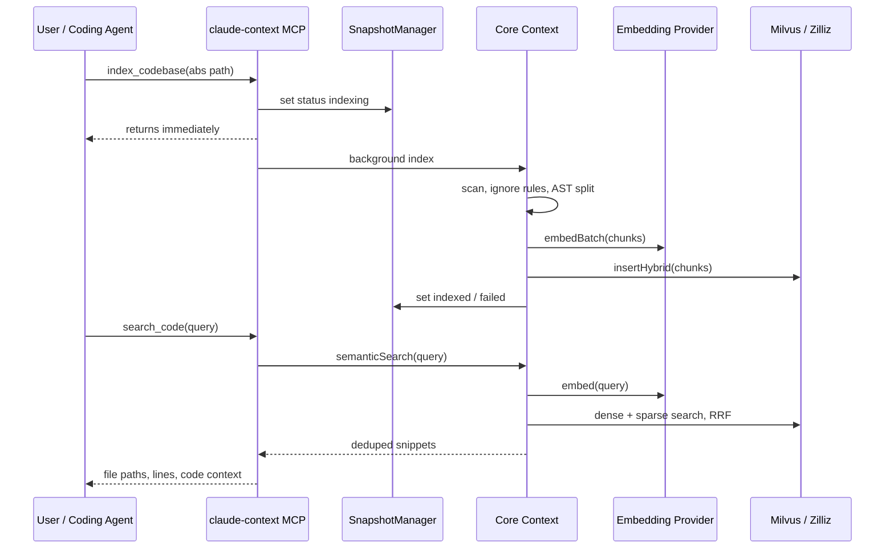
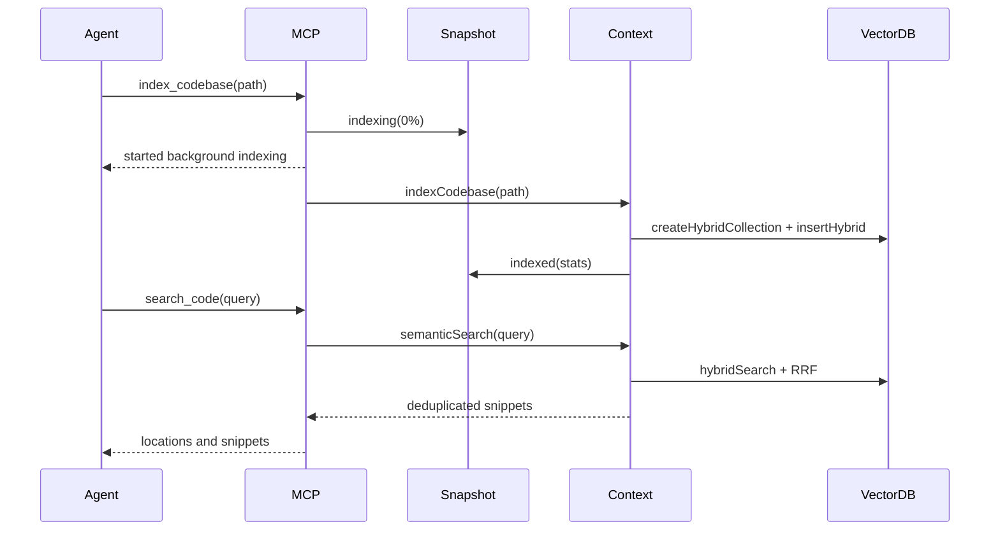
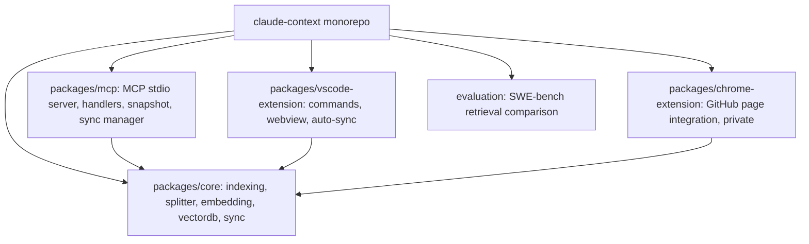

# claude-context 项目洞察

## 0. Metadata

- Project: `zilliztech/claude-context`
- URL: https://github.com/zilliztech/claude-context
- DeepWiki: https://deepwiki.com/zilliztech/claude-context
- Zread: https://zread.ai/zilliztech/claude-context
- Analysis date: 2026-04-30
- Analysis mode: static repository analysis
- Sampling boundary: README, docs, manifests, core/MCP/VS Code/Chrome extension source, CI, release workflow, evaluation directory, license, GitHub metadata
- Runtime boundary: Demo 状态：静态推演，未运行
- Repository HEAD: `367546904b5bcd1d7138a6ae5ca253c8cb0680a1`

## 1. 新用户先看什么

### 适合谁

- 正在用 Claude Code、Cursor、Gemini CLI、Codex CLI、Qwen Code、Roo Code 等 MCP 或类 MCP 编码代理的团队。
- 仓库已经大到 grep/read 多轮探索成本高，且希望把“相关代码发现”做成可复用索引，而不是每次把大量文件塞进上下文的人。
- 可以接受 embedding provider 与 Milvus/Zilliz 这类向量库基础设施的人；需要完全本地时，可评估 Ollama，但仍要验证向量存储与质量。

### 解决什么问题

- AI 编码代理经常先花多轮工具调用找代码：grep 返回太多字面匹配，read 消耗上下文，遗漏跨文件概念关系。
- claude-context 把代码库预先分块、向量化、写入 Milvus/Zilliz，并通过 MCP 暴露 `index_codebase`、`search_code`、`get_indexing_status`、`clear_index`。
- 用户在 agent 里用自然语言搜索，返回带文件路径、行号、语言、片段内容和 rank 的代码上下文。

### 和别的方案哪里不同

- 它的主产品形态是 MCP server，不是单独 IDE 搜索框；agent 可以把检索作为工具调用嵌入修 bug、重构、读代码的工作流。
- 默认走 hybrid search：dense embedding + BM25 sparse vector + RRF reranking，不只是纯向量近邻。
- 它把“大仓库可持续使用”当成核心机制：后台异步索引、搜索期间可返回部分结果、Merkle/SHA-256 增量同步、本地 snapshot 状态、触发文件 watcher、跨进程锁。
- 它不是“无需配置”的本地 grep 替代品；embedding provider、Milvus/Zilliz、绝对路径一致性、索引状态管理都是实际采用边界。

### 为什么现在值得看

- 项目在 2026-04-29 仍有提交，最新 tag 和 npm 版本为 `0.1.11`，GitHub 元数据约 10k stars，说明关注度和迭代都比较强。
- README 和 evaluation 给出明确价值假设：在相近检索质量下减少 token 和工具调用；这正对应 agentic coding 成本和上下文预算问题。
- 源码里已经处理了 MCP stdio 日志污染、后台索引、snapshot 中毒状态、集合限制、跨进程同步等边缘场景，项目成熟度高于普通 demo。

### 最小验证方式

- 选一个 50k 到 500k 行、历史上 grep 定位困难的内部仓库。
- 在同一绝对路径下配置 MCP、OpenAI/VoyageAI/Gemini/Ollama embedding 与 Milvus/Zilliz，执行一次 `Index this codebase`。
- 用 10 个真实维护问题对比：只用 grep/read vs. grep/read + `search_code`，记录 tool calls、输入 token、命中目标文件时间、错误命中率。
- 必须验证索引后增量修改：编辑文件后触发 `~/.context/.sync-trigger` 或等待后台同步，再确认搜索结果更新。

## 2. Gold Example / Demo

- Demo source: README Quick Start, `packages/mcp/src/index.ts`, `packages/mcp/src/handlers.ts`, `packages/core/src/context.ts`, `evaluation/README.md`
- Demo status: Demo 状态：静态推演，未运行
- Demo media relevance: README 的动图/截图是项目使用入口示意；本报告不把它作为运行证明。
- Why this example matters: 它展示 claude-context 最小价值闭环：从 agent 发起索引，到状态查询，再用自然语言找相关代码。

Steps:

1. 在 Claude Code 中添加 MCP server：`npx @zilliz/claude-context-mcp@latest`，提供 embedding 和 Milvus/Zilliz 配置。
2. 用户说“Index this codebase”。MCP `index_codebase` 校验绝对路径、检查 collection 能否创建、把 snapshot 写成 `indexing`，然后后台启动索引并立即返回。
3. 后台流程扫描支持扩展名，合并 ignore 规则，AST 分块，批量生成 embedding，把 chunk 写入 hybrid collection。
4. 用户说“Check indexing status”。`get_indexing_status` 从 `~/.context/mcp-codebase-snapshot.json` 读状态，返回进度、失败原因或完成统计。
5. 用户问“Find functions that handle user authentication”。`search_code` 生成查询 embedding，执行 dense + sparse hybrid search，RRF rerank，去重重叠片段，返回文件路径与行号。

Boundary:

- 本报告没有启动 MCP server，也没有创建 Milvus/Zilliz collection。
- README 中约 40% token reduction 属于项目评估材料；这里作为证据引用，不作为已复现实验结论。

## 3. 项目机制图

- 图型选择: UML sequence + SFD-lite
- 选择理由: 读者最需要理解一次 agent 工具调用如何从 MCP 进入索引/检索管线，同时理解“索引库存”如何随初次索引和增量同步变化。
- 场景: 用户在 Claude Code 中要求“Index this codebase”，随后搜索认证相关函数。
- HTML presentation: report.html 使用可见 SVG 主流程、移动端纵向 fallback，并保留 Mermaid 源码。

Structured source:



## 4. 架构视角

- 项目复杂性评估结果: 中等偏复杂。核心产品是 MCP server，但实际包含 core library、MCP runtime、VS Code extension、Chrome extension、evaluation harness、Zilliz/Milvus integration 和本地状态管理。
- 选用的架构描述框架: C4 L1/L2 + UML sequence。
- 裁剪策略理由: C4 足以解释容器边界；4+1 的物理视图对这个 npm/MCP 工具没有额外信号，核心交互顺序图比泛化视角更重要。
- 省略内容: 未绘制完整部署拓扑和数据库内部索引细节；Chrome extension 标注为扩展面而非主采用路径；未声明运行时性能。

### System Overview

- View type: C4 L1 Context
- Description: 编码代理通过 MCP stdio 调用 claude-context；claude-context 依赖 embedding provider 和 Milvus/Zilliz 存储检索代码 chunk。

```mermaid
flowchart LR
  User[Developer / AI coding agent] --> Client[Claude Code / Cursor / Gemini CLI / Codex CLI]
  Client --> MCP[claude-context MCP server]
  MCP --> Core[@zilliz/claude-context-core]
  Core --> Embedding[OpenAI / VoyageAI / Gemini / Ollama]
  Core --> VectorDB[Milvus / Zilliz Cloud]
  VSCode[VS Code Extension] --> Core
  Chrome[Chrome Extension, private / coming soon] --> Core
```

### Core Process & Interaction

- View type: UML Sequence
- Scenario: agent 发起索引后搜索代码。
- Interaction notes: MCP 立即返回；索引与同步由后台任务维护；搜索可以在 indexing 状态下返回部分结果。



### Static Organization

- View type: C4 L2 Container
- Description: monorepo 以 `packages/core` 为中心，MCP 与 IDE/浏览器扩展复用 core 能力。



## 5. 核心资产与价值

| Asset | Location | Why it matters |
| --- | --- | --- |
| MCP 工具入口 | `packages/mcp/src/index.ts`, `packages/mcp/src/handlers.ts` | 把索引和搜索变成 agent 可调用工具，是区别于普通库的主产品面。 |
| Core Context | `packages/core/src/context.ts` | 聚合文件发现、ignore 规则、分块、embedding、Milvus collection、search/dedup，是系统主干。 |
| AST + fallback splitter | `packages/core/src/splitter/ast-splitter.ts`, `langchain-splitter.ts` | 用语法单元分块，比纯字符切分更适合代码检索；失败时仍有 fallback。 |
| Hybrid vector DB adapter | `packages/core/src/vectordb/milvus-vectordb.ts` | 支撑 dense + sparse/BM25 + RRF，这决定搜索质量上限。 |
| Snapshot and sync managers | `packages/mcp/src/snapshot.ts`, `packages/mcp/src/sync.ts`, `packages/core/src/sync/*` | 决定大仓库索引是否可持续，覆盖中断、增量、跨进程和 stale state。 |
| Evaluation harness | `evaluation/` | 给出 token/tool-call 减少的可检验假设，也为采用方复现实验提供入口。 |
| Multi-surface distribution | `packages/mcp`, `packages/vscode-extension`, `packages/chrome-extension` | MCP 是主路径，VS Code 扩展扩大使用面，Chrome extension 显示后续方向但当前仍偏实验。 |

## 6. 采用前确认与证据边界

### 采用前确认

- 先确认数据边界：是否允许把代码片段发送给 OpenAI/VoyageAI/Gemini，若不允许，要验证 Ollama + Milvus 的本地组合质量和运维成本。
- 先确认向量库策略：Zilliz Cloud 上手快，但生产场景要看 collection limit、权限、网络延迟、备份和清理流程。
- 先确认路径一致性：工具以解析后的绝对路径识别 codebase；symlink、不同 clone 路径、容器挂载路径会形成不同索引。
- 先确认 CI 质量缺口：仓库 CI 做跨 OS/Node build，但 lint 被注释，测试样本很少；引入前应跑 `pnpm build`、package tests 和自己的检索回归集。
- 先确认评估外推性：项目评估使用 30 个筛选后的 SWE-bench Verified case 和特定模型/版本，不能直接代表内部仓库收益。

### 证据与边界

| Type | Source | Supports |
| --- | --- | --- |
| README/docs | `README.md`, `docs/getting-started/*`, `docs/dive-deep/*` | 定位、quick start、异步索引、文件纳入规则、环境变量 |
| code | `packages/core/src/*`, `packages/mcp/src/*` | MCP 工具、后台索引、hybrid search、snapshot/sync、分块和去重 |
| config | `package.json`, package manifests, `.github/workflows/*` | monorepo 结构、npm 发布、Node/pnpm 要求、CI/build/release |
| repo-meta | GitHub metadata via `gh repo view`, git HEAD/tag/npm view | 活跃度、默认分支、stars/forks/issues、版本 |
| license | `LICENSE` | MIT 可采用边界 |
| static-inference | 源码与文档交叉推断 | 采用适配性、风险、最小验证路径；未代表实测运行结果 |

## 结论

claude-context 值得作为“大仓库 agentic coding 检索层”试点，尤其适合已经使用 MCP 客户端、愿意维护 embedding/vector DB 配置的团队。它的关键价值不是单点语义搜索，而是把索引、状态、增量同步和 agent 工具调用整合成一个可持续上下文层。

采用前的主要问题不在 API 是否存在，而在运维和质量闭环：外部服务合规、向量库成本、索引一致性、内部任务集上的检索收益，以及当前 CI/test 覆盖是否满足你的生产门槛。
