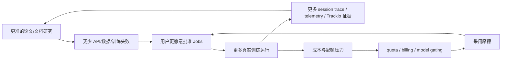
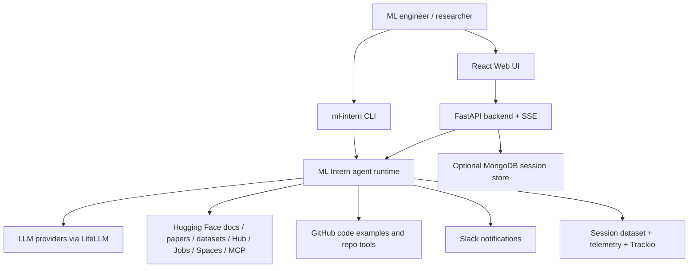
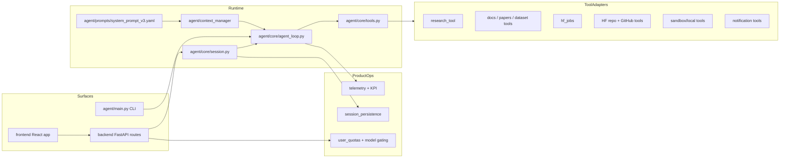

# ML Intern 项目洞察

## 0. Metadata

- Project: ML Intern
- URL: https://github.com/huggingface/ml-intern
- Analysis date: 2026-04-30
- Analysis mode: Static repository analysis
- Sampling boundary: README, manifests, core agent loop, tool router, system prompt, backend API, frontend SSE transport, persistence/telemetry code, tests, CI/review workflows, GitHub API metadata
- Runtime boundary: Demo 状态：静态推演，未运行
- Inspected commit: `5db99fadaf6ef578a02c3692e7845c1c3855b0e5`

## 1. 新用户先看什么

### 适合谁

- **最适合**：已经在 Hugging Face 生态内做模型训练、微调、数据处理或评估的 ML 工程师/研究工程师，尤其是希望把“查论文、查当前 API、审数据、写训练脚本、开 HF Jobs、看 Trackio”串成一个闭环的人。
- **也适合**：评估垂直 Agent 产品形态的团队。它不是通用 coding agent 的简单包装，而是把 Hugging Face 的文档、论文、数据集、Hub、Jobs、Sandbox、MCP 和 Web UI 拉进同一个执行系统。
- **不适合直接采用的场景**：需要明确开源许可、企业级安全审计、稳定发行版本或生产 SLA 的团队。GitHub API 与本地树都显示当前没有明确 license/release/tag。

### 解决什么问题

ML Intern 试图解决的是 ML 工程任务里的“知识过期 + 环境繁琐 + 训练结果难沉淀”问题。README 的定位是一个能自主研究、写代码、并在 Hugging Face 生态内交付 ML 代码的 intern；系统提示进一步把流程固化为先查论文和近期实现，再验证数据集/模型，再进 sandbox 和 HF Jobs。

它把通用 agent loop 里的工具调用变成 ML 任务所需的操作面：

- 研究：HF Papers、HF Docs、GitHub examples、web search。
- 数据与模型验证：HF dataset inspection、Hub repo tools。
- 执行：sandbox/local tools、HF Jobs、repo file/git tools。
- 观察与迭代：Trackio、telemetry、session traces、KPI rollups。
- UI 协作：CLI、FastAPI/SSE、React/Vercel AI SDK frontend、审批流、恢复流。

### 和别的方案哪里不同

- **不是“问答式 HF 文档助手”**：系统提示明确要求在写 ML 代码前先从论文和 citation graph 开始，并把方法、数据集、超参和结果绑定起来。
- **不是纯本地 CLI**：CLI 和 Web 后端共享同一套 agent loop，但 Web 侧还有 OAuth、SSE、session persistence、quota、billing-required UX、model picker 和 reconnect。
- **不是只会生成脚本**：核心 workflow 要求 sandbox-first、HF Jobs launch、push_to_hub、Trackio dashboard 和训练告警；这更接近“实验执行代理”而不是代码片段生成器。
- **风险控制比 demo repo 更厚**：代码里有 approval batching、destructive op gating、malformed tool recovery、doom-loop detection、context compaction、stale sandbox cleanup、quota gating、event replay 和 Mongo fallback。

### 为什么现在值得看

这个项目在 2026-04-30 仍非常活跃：GitHub API 快照显示当天刚推送，最近提交集中在 OpenAI/GPT-5.5 模型选择、Bedrock/LLM 成本归因、Pro 转化、billing top-up、UI 阻断状态等真实产品化问题。它的价值不只在“Agent 能跑训练”，也在它暴露了一套面向 ML 工作负载的 agent product surface：成本、权限、恢复、审批、数据沉淀和用户付费边界。

### 最小验证方式

静态验证之后，如果要做真实试用，建议用一个低风险公开数据集和小模型跑端到端闭环：

1. 用 CLI 启动：`uv sync && uv tool install -e . && ml-intern`。
2. 给一个明确但低成本的任务，例如“基于公开小数据集写一个 SFT 验证脚本，不启动大规模训练，先只做 dataset schema audit 和 dry-run”。
3. 检查它是否按系统提示先查当前 API/示例、验证 dataset/model、生成 Trackio/Jobs pre-flight，而不是直接幻觉代码。
4. 只在通过 sandbox dry-run 后，再批准一个小规格 HF Job。
5. 审查产物：脚本、日志、Hub artifact、Trackio dashboard、session trace 是否能复盘。

## 2. Gold Example / Demo

- Demo source: README quick start + system prompt workflow + tool/router/backend evidence
- Demo status: Demo 状态：静态推演，未运行
- Demo media relevance: 仓库只有 `smolagents.webp` 标志图，不能直接展示核心产品工作流，因此不作为 Gold Example 媒体使用。
- Why this example matters: 这个场景覆盖 ML Intern 的核心差异点：论文/文档研究、数据检查、sandbox-first、HF Jobs、审批、Trackio 和产物上传。

Steps:

1. 用户输入：`ml-intern "fine-tune a small instruct model on my dataset and publish the result to the Hub"`。
2. Agent 先调用 research 子流程，查论文/近期代码/HF docs，确认当前 TRL/Transformers/Trackio API。
3. Agent 调用 dataset/model inspection，确认 schema、split、样本和模型可用性。
4. Agent 在 sandbox 中写并小规模运行训练脚本，修复导入、参数和数据格式问题。
5. Agent 输出 HF Jobs pre-flight：参考实现、数据格式、`push_to_hub=True`、`hub_model_id`、timeout、Trackio dashboard。
6. 需要用户批准后才提交 Jobs 或执行敏感 repo 操作。
7. 前端/CLI 通过事件流看到 tool_call、tool_output、approval_required、billing_required、turn_complete 等状态。
8. 完成后，结果应能在 Hub 模型、Trackio、session trace 或日志中复盘。

Boundary:

- 该 demo 是静态推演，没有验证真实 token、Jobs 权限、GPU quota、模型下载、训练时长、成本、Trackio dashboard 或 Hub 上传。

## 3. 项目机制图

- 图型选择 / Selected diagram types: UML Sequence + CLD feedback overlay
- 选择理由 / Selection reason: 核心价值来自一次 ML 任务如何穿过研究、工具、审批、远程执行、监控和复盘；同时项目近期提交显示成本归因、quota、billing 和转化反馈是产品化关键。
- 场景 / Scenario: 用户从 CLI/Web 发起一次 ML 训练任务，系统从研究到交付形成闭环。
- HTML presentation: HTML 中渲染为可读 SVG 流程图，并保留 Mermaid 源。

Structured source:

```mermaid
sequenceDiagram
    participant U as User / Web / CLI
    participant API as CLI or FastAPI SSE
    participant Loop as agent_loop
    participant Ctx as ContextManager
    participant Tools as ToolRouter
    participant HF as HF Docs/Papers/Datasets/Hub/Jobs
    participant Box as Sandbox / Local Tools
    participant Obs as Trackio / Telemetry / Session Trace

    U->>API: ML task request
    API->>Loop: user_input operation
    Loop->>Ctx: add user message, compact if needed
    Loop->>Tools: expose tool specs
    Loop->>HF: research papers, docs, datasets, repo examples
    HF-->>Loop: evidence and current API patterns
    Loop->>Box: write and dry-run script
    Box-->>Loop: logs, files, errors
    Loop->>U: approval_required for HF Jobs or destructive ops
    U-->>Loop: approve / reject / edit
    Loop->>HF: launch job, upload repo/model, inspect job logs
    HF-->>Obs: job, cost, trace and result signals
    Obs-->>Loop: alerts, usage, replayable context
    Loop-->>U: final answer with Hub / Trackio / job links
```

Feedback loop:



## 4. 架构视角

- Project complexity: 中高复杂度。单仓库规模不大，但横跨 CLI、agent runtime、ML 工具、HF cloud resources、FastAPI/SSE、React UI、OAuth、Mongo persistence、telemetry、quota 和 CI review automation。
- Selected architecture framework: C4 L1/L2 + core dynamic sequence。4+1 不强行展开，因为部署拓扑和运维边界证据不足；核心交互图比完整 4+1 更有解释力。
- Tailoring reason: 读者最需要理解“谁调用谁、敏感操作在哪里审批、ML 资源如何进入闭环”，而不是抽象的逻辑/物理视图。
- Omitted views: 省略完整物理部署图、数据仓库建模和安全威胁模型；代码提供了一些 OAuth/Mongo/HF Space 线索，但没有足够部署配置或生产 runbook 来支撑完整视图。

### System Overview

- View type: C4 L1 Context
- Description: ML Intern 位于用户、模型提供商、Hugging Face 平台资源、GitHub 和可选通知/持久化系统之间。



### Core Process & Interaction

- View type: C4 Dynamic / UML Sequence
- Scenario: 一个 Web 会话提交任务、流式执行、审批 HF Jobs、恢复中断事件。
- Interaction notes: 后端先订阅 broadcaster 再提交任务，避免错过事件；前端保存 event seq 并通过 `/api/events/{session_id}` 重新连接。

```mermaid
sequenceDiagram
    participant UI as React UI
    participant SSE as SSEChatTransport
    participant API as /api/chat/{session}
    participant SM as SessionManager
    participant Loop as agent_loop
    participant Tool as ToolRouter

    UI->>SSE: sendMessages()
    SSE->>API: POST text or approvals
    API->>SM: subscribe broadcaster before submit
    API->>SM: submit_user_input / submit_approval
    SM->>Loop: operation queue
    Loop->>Tool: execute non-approval tools in parallel
    Loop-->>API: event_queue messages
    API-->>SSE: text/event-stream
    SSE-->>UI: UIMessageChunks + side-channel state
    Loop-->>UI: approval_required / billing_required when needed
```

### Static Organization

- View type: C4 L2 Container
- Description: 项目是一个单仓库多 surface 系统：agent runtime 是核心，CLI/Web 只是入口，工具层和持久化/遥测是可扩展边界。



## 5. 核心资产与价值

| Asset | Location | Why it matters |
| --- | --- | --- |
| ML-specific system prompt | `agent/prompts/system_prompt_v3.yaml` | 把“先研究、审数据、sandbox、Jobs、Trackio、错误恢复”写成可执行行为约束，是项目的产品灵魂。 |
| Agent loop | `agent/core/agent_loop.py` | 处理 streaming/non-streaming LLM、tool calls、审批、并行工具执行、context compaction、doom-loop recovery、错误和中断。 |
| ToolRouter and adapters | `agent/core/tools.py`, `agent/tools/**` | 将 HF Docs/Papers/Datasets/Jobs/Hub/GitHub/Sandbox/MCP 统一暴露给 LLM，是差异化能力来源。 |
| HF Jobs + sandbox path | `agent/tools/jobs_tool.py`, `agent/tools/sandbox_tool.py` | 让 agent 从“写代码”进入“可运行训练与发布”阶段，同时包含硬件、token、billing、日志和 cleanup 细节。 |
| Web collaboration surface | `backend/routes/agent.py`, `frontend/src/lib/sse-chat-transport.ts` | 支持 SSE、approval continuation、event replay、quota/billing UI、model switching 和 session recovery。 |
| Session persistence and telemetry | `agent/core/session_persistence.py`, `agent/core/telemetry.py` | 让会话、事件、trace、quota、cost、Pro conversion、KPI 能成为可运营的数据资产。 |
| Review and tests harness | `tests/**`, `REVIEW.md`, `.github/workflows/**` | 体现项目正在用较严的 review 自动化和单元/集成测试保护快速迭代。 |

## 6. 采用前确认与证据边界

### 采用前确认

- **许可先决条件**：仓库当前没有检测到 LICENSE，GitHub API `license` 为 `null`。任何复制、二次分发、商用或内嵌前都应先等 Hugging Face 明确许可。
- **成本与凭证**：真实使用会涉及 Anthropic/OpenAI/HF token、HF Jobs credits、Sandbox/Space 资源、可能的 Bedrock 成本和 Trackio/Hub 公开资产。需要先定义 token 权限和花费上限。
- **数据与隐私**：默认 config 会保存 sessions 到 `smolagents/ml-intern-sessions`。如果处理私有数据集、私有代码或客户提示，需要检查 session trace、telemetry 和 upload 行为。
- **生产稳定性**：项目没有 release/tag，近期提交仍在修复 live Space、quota、billing、成本归因和 UI 阻断问题。建议先作为实验性工具或内部试点，不要直接承担关键训练链路。
- **安全模型**：审批、OAuth、org gating、destructive op checks 已有实现，但还需要独立验证 sandbox 隔离、repo write 权限、MCP server trust、prompt-injected tool calls 和 secret redaction。
- **可维护性**：核心价值高度依赖系统提示与工具协议一致性。升级 TRL/Transformers/HF Hub/LiteLLM/Vercel AI SDK 时，应该同步跑 agent loop、SSE、tool schema 和 UI approval 测试。

### 证据与边界

| Type | Source | Supports |
| --- | --- | --- |
| README/docs | `README.md:5-283`, `agent/README.md` | 项目定位、安装、CLI/headless 使用、Slack gateway、架构和事件模型。 |
| code | `agent/core/agent_loop.py`, `agent/core/tools.py`, `agent/tools/**` | agent loop、tool router、approval、sandbox、HF Jobs、research/docs/dataset/repo capabilities。 |
| code | `backend/routes/agent.py`, `frontend/src/lib/sse-chat-transport.ts` | Web session、SSE、approval continuation、quota/billing UX、reconnect。 |
| config | `pyproject.toml`, `configs/*.json`, `frontend/package.json` | Python/JS dependencies、entrypoint、MCP defaults、session save defaults、frontend stack。 |
| repo-meta | GitHub API snapshot 2026-04-30 | 活跃度、stars/forks/issues、created/updated/pushed dates、primary language、license null。 |
| license | GitHub API + local file scan | 没有发现 LICENSE；采用前必须确认许可。 |
| tests/CI | `tests/**`, `.github/workflows/**`, `REVIEW.md` | 覆盖 agent/runtime/product safety 的测试与自动 review 机制。 |
| static-inference | cross-file architecture reading | 采用判断、风险边界、最小验证路径、架构复杂度。 |

## Bottom Line

ML Intern 是一个值得研究的 ML Agent 产品原型：它把 Hugging Face 生态资源做成了 agent 可执行的工具面，并且认真处理了审批、成本、恢复、持久化和 UI 协作这些“demo 到产品”之间的难题。当前更适合做内部试点、架构参考和垂直 agent 设计样本；在 license、release、生产安全与成本边界明确前，不建议直接作为可再分发或生产依赖使用。
