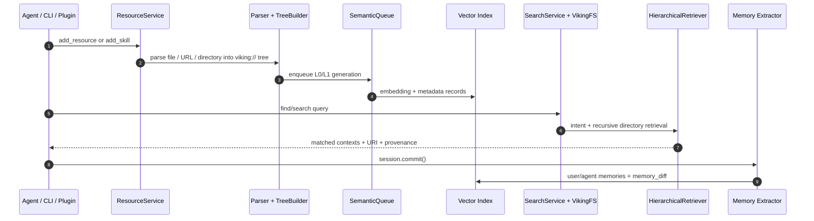
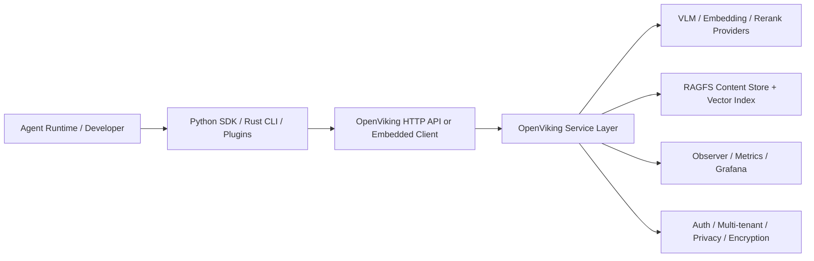
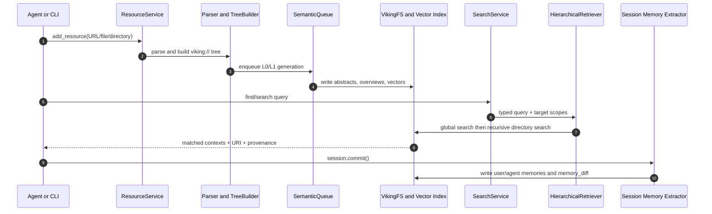
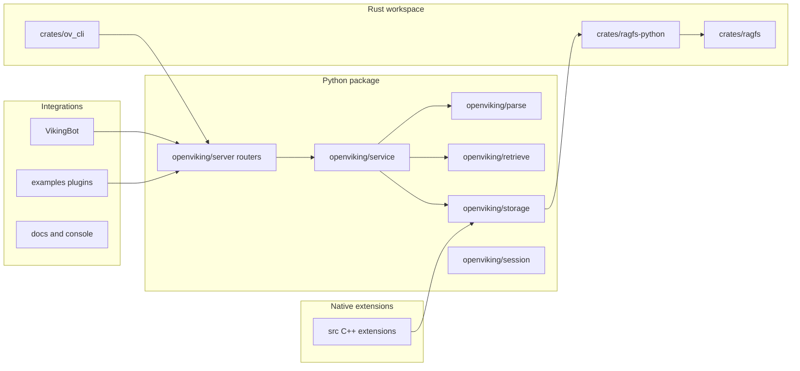
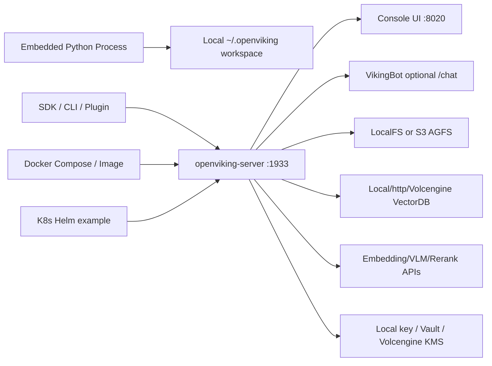

# OpenViking 项目洞察报告

## 0. Metadata

- Project: OpenViking
- URL: https://github.com/volcengine/OpenViking
- Analysis date: 2026-05-06
- Analysis mode: 静态分析
- Sampling boundary: README、docs/en、examples、pyproject/Cargo/Docker/CI、核心 Python/Rust 源码、GitHub API 元数据
- Runtime boundary: Demo 状态：静态推演，未运行
- Observed repo state: latest clone commit `44d3cc4` at 2026-05-06T10:45:06+08:00；latest release `v0.3.13` published 2026-04-29

## 1. 新用户先看什么

### 适合谁

- 正在构建长任务 AI Agent、编码 Agent、研究 Agent 或企业内部助理的团队。
- 需要把文档、代码仓库、用户偏好、工具经验和 Agent 技能长期管理起来的平台工程团队。
- 想研究 context engineering、agentic RAG、记忆生命周期和多租户上下文隔离的技术读者。

### 解决什么问题

- Agent 上下文常散落在 prompt、向量库、文件、插件和聊天历史里，缺少统一读写与审计边界。
- 传统 RAG 往往是平铺 chunk 检索，难以解释“为什么命中这里”，也难以让 Agent 逐层读取细节。
- 长会话会产生大量可沉淀经验，简单截断或压缩会丢失可复用记忆。

### 和别的方案哪里不同

- 它把上下文映射到 `viking://resources`、`viking://user/memories`、`viking://agent/skills` 等目录，而不是只暴露向量搜索 API。
- 写入后异步生成 L0 摘要、L1 overview 和 L2 原文，检索时先定位目录再递归下钻，并保留 retrieval provenance。
- 项目同时提供 Python SDK、HTTP API、Rust CLI、MCP/WebDAV、Claude Code/OpenClaw/OpenCode 插件、VikingBot 和 Docker/Helm 部署资产。

### 为什么现在值得看

- Agent 应用从“单次问答”转向长期任务后，上下文治理、记忆复用和检索可观测性会成为工程瓶颈。
- 仓库在 2026-05-06 仍非常活跃，最近提交涉及 memory isolation，说明多用户/多 Agent 场景正在快速演进。
- 它已经把概念文档、API、测试、CI、观测面板、插件示例和发布流程都放进仓库，足够做技术试点评估。

### 最小验证方式

- 本地或 Docker 启动 server，配置 embedding 与 VLM，先导入一个小型代码仓库或文档目录。
- 用 `ov ls/tree/find/grep` 或 Python `client.find()` 验证 `viking://` 目录、L0/L1/L2 和检索命中是否可解释。
- 再接入一个 Claude Code/OpenClaw/OpenCode 低风险会话，验证自动 recall、session commit、memory diff 和隐私边界。

## 2. Gold Example / Demo

- Demo source: `examples/quick_start.py`、README CLI quick start、`docs/images/ov-provenance-example.png`
- Demo status: Demo 状态：静态推演，未运行
- Demo media relevance: provenance 示例图直接展示 Search Results、searched directories、matched contexts 和 thinking trace，能解释“可观测检索轨迹”这一核心价值。
- Why this example matters: 它把 OpenViking 的完整价值链压缩为一个可验证路径：导入资源、等待语义处理、读取 L0/L1、语义检索、查看命中 URI 和 provenance。

Steps:

- 用 Python SDK 或 `ov add-resource` 导入一个 URL、文件或目录，目标落到 `viking://resources/...`。
- ResourceProcessor 解析内容，TreeBuilder 写入 AGFS/RAGFS，SemanticQueue 异步生成 `.abstract.md` 与 `.overview.md` 并写入向量索引。
- Agent 用 `find` 做简单语义检索，或用 `search` 结合 session context 生成 typed queries。
- 检索结果返回 URI、层级、摘要、相关上下文和可选 provenance，Agent 再按需读取 L1/L2 细节。

Boundary:

- 本轮没有安装依赖、没有启动 `openviking-server`、没有调用模型服务，也没有复现实验表格中的 OpenClaw 效果。

## 3. 项目机制图

- 图型选择: UML Sequence, UML Component, CLD, SFD
- 选择理由: OpenViking 的关键机制横跨资源导入、语义队列、向量索引、会话记忆和插件消费；用一次检索任务的 UML 主链路解释执行边界，再用 CLD/SFD 表达上下文积累、信任和风险控制。
- 场景: Agent 导入一个代码仓库/文档资源，随后在长任务中检索相关上下文并把会话经验沉淀为记忆。

## 4. 架构视角

- 项目复杂性评估结果: 高，包含 Python 服务、Rust CLI/RAGFS、C++ 扩展、向量索引、异步队列、插件、Bot、Docker/Helm、多租户/加密/观测。
- 选用的架构描述框架: 4+1 作为判断框架，具体图用 C4 L1/L2、UML Sequence 和 Deployment flowchart 表达。
- 裁剪策略理由: 完整 4+1 会过重；本报告保留 Scenario、Process、Development/Implementation 和 Deployment/Physical。Logical view 合并到 C4 容器/组件图中。
- 省略内容: 未画数据库 ERD 和每个 API router 细节；静态分析无法确认真实运行性能、模型调用质量和云端商业服务边界。

### 系统全貌

- View type: C4 L1 Context / Scenario View
- Description: OpenViking 位于 Agent runtime 与模型/存储基础设施之间，向 CLI、SDK、HTTP、MCP、WebDAV 和插件提供同一套上下文数据库能力。

### 核心业务流转 -> PRIORITY

- View type: UML Sequence / Process View
- Scenario: 导入资源后，Agent 在一次任务中检索上下文并在 commit 时沉淀长期记忆。
- Interaction notes: 资源写入、语义分层、递归检索、会话记忆是 OpenViking 最核心的四段链路。

### 静态组织结构

- View type: Development / Implementation View
- Description: 源码组织显示这是多语言系统：Python 负责服务和业务层，Rust 负责 CLI/RAGFS，C++ 扩展承担底层索引/能力探测，Bot 和插件负责上层集成。

### Deployment / Physical View

## 5. 核心资产与价值

| Asset | Location | Why it matters |
| --- | --- | --- |
| `viking://` URI 与目录语义 | `docs/en/concepts/02-context-types.md`, `03-context-layers.md`, `04-viking-uri.md`, `openviking/storage/viking_fs.py` | 让 Agent 像操作文件一样管理资源、记忆和技能。 |
| L0/L1/L2 分层处理链 | `openviking/parse/`, `openviking/parse/tree_builder.py`, `openviking/storage/queuefs/`, docs concepts | 把检索、导航和细读分开，降低一次性上下文注入成本。 |
| HierarchicalRetriever | `openviking/retrieve/hierarchical_retriever.py` | 支持全局定位、目录递归、score propagation、rerank fallback 和 relations。 |
| Session memory lifecycle | `docs/en/concepts/08-session.md`, `openviking/service/session_service.py`, `openviking/session/` | 把长会话归档、压缩、抽取记忆和 memory_diff 审计串起来。 |
| 部署与集成资产 | `examples/`, `crates/ov_cli/`, `Dockerfile`, `docker-compose.yml`, `deploy/helm`, `bot/` | 降低从本地试点到插件/服务化部署的迁移成本。 |
| 安全与治理资产 | `docs/en/concepts/10-encryption.md`, `11-multi-tenant.md`, `13-privacy.md`, `openviking/server/auth.py` | 支撑多用户、多 Agent 和敏感上下文的生产化讨论。 |

## 6. 采用前确认与证据边界

### 采用前确认

- 先把试点范围限定在非敏感仓库或文档，确认导入、分层摘要、检索结果和 provenance 是否符合团队调试习惯。
- 确认 AGPL-3.0 对服务化部署和二次修改的合规影响；Rust crates/examples 的 Apache-2.0 不能覆盖主项目许可证。
- 压测模型调用成本与延迟，尤其是 VLM 摘要、embedding、rerank、长会话 commit 和批量资源导入。
- 生产部署必须配置 root/user key、account/user/agent 边界、加密 provider、日志脱敏、备份和再索引策略。
- 把插件接入低风险 Agent 后再逐步扩大，不要直接把个人/客户长期记忆导入未审计的共享实例。

### 证据与边界

| Type | Source | Supports |
| --- | --- | --- |
| README/docs | `README.md`, `docs/en/concepts/*.md`, `docs/en/api/01-overview.md` | 项目定位、五个核心概念、API 面、部署模式、检索和 session 机制。 |
| code | `openviking/service/core.py`, `openviking/storage/viking_fs.py`, `openviking/retrieve/hierarchical_retriever.py`, `openviking/server/app.py` | 服务组合、URI 边界、检索实现、FastAPI router 注册和错误 envelope。 |
| config | `pyproject.toml`, `Cargo.toml`, `Dockerfile`, `docker-compose.yml`, `.github/workflows/*.yml` | 语言/依赖、CLI/RAGFS workspace、容器部署、CI/发布/测试边界。 |
| repo-meta | GitHub API sampled 2026-05-06 | stars/forks/issues、default branch、release、license、pushed_at。 |
| license | `LICENSE`, `crates/LICENSE`, `examples/LICENSE` | 主项目 AGPL-3.0；crates/examples Apache-2.0。 |
| static-inference | 源码结构和文档交叉判断 | 采用风险、架构复杂度、最小试点路径；未代表真实运行结果。 |
