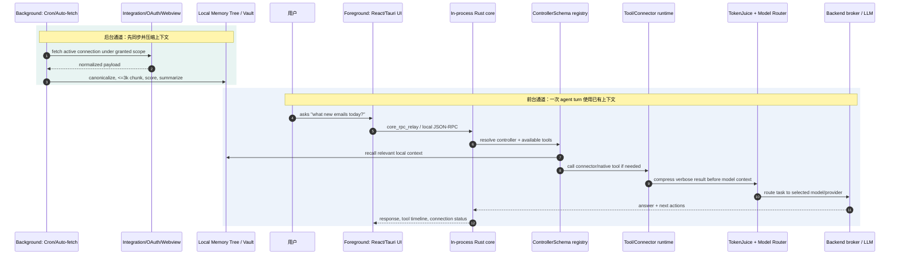
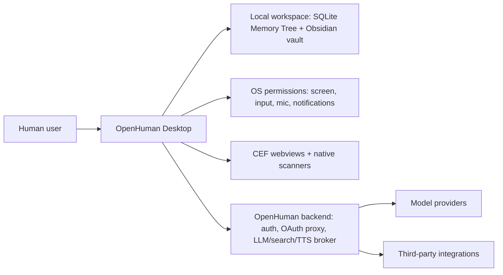
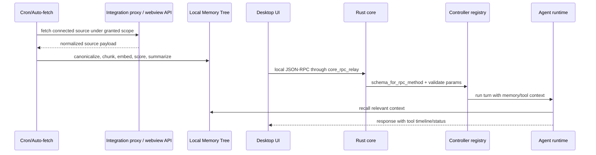
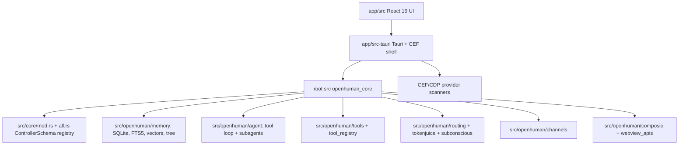

# OpenHuman 项目洞察

## 0. Metadata

- Project: OpenHuman
- URL: https://github.com/tinyhumansai/openhuman
- Analysis date: 2026-05-18
- Analysis mode: 静态仓库分析 + Zread 线索核验
- Sampling boundary: README、CLAUDE.md、GitBook docs、Rust/TypeScript manifests、核心模块 README、CI、license、GitHub API metadata、Zread overview；采样默认分支 `main`，manifest version `0.53.49`
- Runtime boundary: Demo 状态：静态推演，未运行。没有本地安装、登录、OAuth、桌面构建、抓包或端到端执行。

## 1. 新用户先看什么

### 适合谁

- 想要“桌面个人 AI agent + 本地长期上下文”的用户，而不是只想找一个网页聊天窗口的人。
- 愿意用测试账号验证 Gmail、Slack、Calendar、GitHub、Notion 等连接源 auto-fetch、记忆写入、撤销连接和本地残留行为的技术用户或团队。
- 研究 agent harness、长期记忆、工具/技能注册、桌面权限、CEF/Tauri、Rust core 架构的开发者。
- 能接受 early beta、GPL-3.0、后端 broker、OAuth 代理、桌面权限和较高本地构建成本的人。

### 解决什么问题

- 多数 AI 助手是 **conversation first**：先聊天，再靠用户不断补上下文。OpenHuman 试图反过来做 **context first, conversation second**：先把连接源压缩成本地 Memory Tree，再让对话从已有个人上下文开始。
- 多工具 agent 往往要求用户自己装插件、配 API key、写 glue code；OpenHuman 把 118+ OAuth 集成、typed tools、native tools、model routing、TokenJuice、voice、meeting agent 和桌面入口打包为一个产品。
- 桌面 AI 工具如果只做聊天，很难触达真实工作环境；OpenHuman 把 screen intelligence、text input、voice、notifications、channels、meeting、webview scanners 和本地 workspace 放进同一 runtime。
- Mascot/Meeting/Voice 不是 UI 点缀：GitBook meeting agent 文档把目标写成“作为真实参会者加入 Google Meet”，用 streaming STT 听会、TTS 注入 outbound mic feed 发言、mascot canvas 作为 outbound camera，并把会议 transcript 折进 Memory Tree。

### 和别的方案哪里不同

- 核心差异不是“有 agent”或“有 memory”，而是 **连接源 auto-fetch -> canonicalize/chunk/score -> Memory Tree/Obsidian vault -> agent turn 召回 -> 工具/模型路由** 的完整上下文流水线。
- README 明确写出每 20 分钟 core 会遍历 active connection 把新数据拉入 memory tree；连接数据 canonicalized into `<=3k-token` Markdown chunks，scored，并 folded into hierarchical summary trees。
- `src/core/mod.rs` 把 `ControllerSchema` 定义成 transport-agnostic contract；`src/core/all.rs` 再把 domain controller 汇总给 CLI/RPC 使用。这比“all.rs 注册了很多模块”更重要，因为它说明项目在用统一 contract 管理桌面、CLI、JSON-RPC 和 agent-facing tool surface。
- CEF webview scanner 方向也是差异点：`CLAUDE.md` 要求 migrated provider 通过 native CDP scanner 和 IndexedDB 观察，不再新增 JS injection。这是桌面集成的安全/可维护性选择。
- Meeting Agent 进一步把“个人上下文 agent”推进到实时协作空间：听会 -> diarize/postprocess transcript -> 写入 Memory Tree 的 people/topics/project 维度 -> 会中调用 memory/integrations/native tools/Subconscious Loop -> 通过 TTS/camera/lip-sync 回到会议。

### 为什么现在值得看

- GitHub API 在 2026-05-18 采样时显示：项目创建于 2026-02-18，默认分支当天仍有 push，约 14.0k stars、1.2k forks、116 open issues，早期关注度和更新速度都很高。
- 仓库里已有 Rust/TypeScript manifests、CI、coverage gate、release workflows、Debian/Homebrew/npm packaging 和桌面 E2E 指南，说明它不只是概念 demo。
- 同类产品正在从“聊天 + 插件”转向“本地上下文 + 多入口 agent”。OpenHuman 是高集成度、也高风险的样本。

### 最小验证方式

- 不要先接入真实主邮箱。用测试账号安装桌面端，连接一个低风险集成，触发 auto-fetch，检查本地 `<workspace>/memory_tree/chunks.db` 与 `<workspace>/wiki/` 是否出现预期内容。
- 用 README 的 Gmail 场景做最小闭环：问“今天新邮件有什么”，观察连接状态、工具调用、摘要质量、失败提示和撤销连接后的行为。
- 做一次隐私边界验证：抓包或日志确认 raw source data、OAuth token、LLM context、TTS/search proxy 分别经过哪里。
- 对开发者：先跑 `pnpm install`、`pnpm typecheck`、`cargo check --manifest-path Cargo.toml`、`cargo check --manifest-path app/src-tauri/Cargo.toml`，再决定是否投入 Tauri/CEF 桌面构建。

## 2. 核心创新提取

### 范式反转 / 独特假设

- OpenHuman 拒绝的默认假设是：个人 agent 必须从 chat history 或用户手动粘贴上下文开始工作。它押注的是“先同步并压缩个人数字生活，再让对话使用已存在的上下文”。
- 它也拒绝“桌面壳只是 UI”的假设。Tauri/CEF shell 不只显示页面，还承载 webview account、scanner、screen capture、notifications、meeting/voice 等 OS/浏览器边界能力。

### 具名机制与证据

| Mechanism | What it changes | How it works | Evidence | Verify/Risk |
| --- | --- | --- | --- | --- |
| Context first, conversation second | 从空白聊天变成先有本地上下文再对话 | 连接源 auto-fetch 后进入 Memory Tree，agent turn 再召回 | `README.md` 的 “Context in minutes, not weeks” 与 20-minute sync 描述 | 需要运行验证一次 sync 后 agent 是否真的使用本地记忆 |
| Memory Tree + Obsidian vault | 把外部数据变成可检索、可浏览、可编辑的长期记忆 | canonicalize、chunk、embed/score、SQLite/FTS/vector/graph、three concentric trees、Markdown vault | `README.md`, `src/openhuman/memory/README.md`, `gitbooks/features/privacy-and-security.md` | 需要验证本地数据残留、撤销连接、embedding/summary 是否上云 |
| Intelligence Layer: Model Routing + TokenJuice + Subconscious | 降低多模型/长上下文/后台任务的操作复杂度 | Model router 选模型；TokenJuice 在 tool output 入 LLM 前按 builtin/user/project rule overlay 执行 classify -> match rule -> reduce，把冗长工具结果先降噪再进上下文；subconscious/cron 承担后台任务 | `README.md`, `gitbooks/features/token-compression.md`, `CLAUDE.md`, `src/openhuman/{routing,tokenjuice,subconscious}` | 需要量化压缩质量、成本、延迟和后台任务权限 |
| Controller System / `ControllerSchema` | 把 domain logic 从具体 transport 中抽出来 | schema 声明 namespace、function、I/O；registry 统一暴露给 CLI/RPC | `src/core/mod.rs`, `src/core/all.rs`, `src/core/dispatch.rs` | 需要检查 legacy dispatcher 仍存在时是否有 contract drift |
| CEF webview scanner without new JS injection | 降低第三方 webview 注入脚本的攻击面 | migrated providers 用 native CDP scanner、IndexedDB/Network/Page/Input 侧能力，不新增 init script | `CLAUDE.md`, `app/src-tauri/src/*_scanner`, `app/src-tauri/src/webview_accounts` | 需要运行验证各 provider 登录、采集和平台 ToS/权限风险 |
| Mascot / Meeting Agent / Native Voice | 把 agent 从桌面聊天面板推进到实时会议参与者 | Meet child webview 不注入 JS；streaming STT + diarization 生成 transcript；TTS 写入 outbound mic feed；mascot canvas/lip-sync 写入 outbound camera；会议内容进入 Memory Tree，并可会中调用工具 | `README.md`, `gitbooks/features/mascot/meeting-agents.md`, `src/openhuman/meet_agent/brain.rs`, `src/openhuman/voice/`, `app/src/features/meet/MascotFrameProducer.tsx`, `mascot_native_window.rs` | 需要验证会议同意、音视频设备路由、平台政策、延迟、说话打断和 transcript 隐私 |
| Backend broker boundary | 用一个后端代理处理必须 broker 的能力 | backend 代理 LLM、OAuth/token、search、TTS；memory/vault 留本地 | `gitbooks/features/privacy-and-security.md`, README subscription/model routing 描述 | 需要抓包确认 raw data、prompt context、token 存储实际路径 |

### 外部导览核验

- Zread 被采纳的线索：`context first, conversation second`、Memory Tree 细节、Intelligence Layer 三件套、Controller System、CEF webview scanner。
- Zread 被修正的线索：它称 Rust core 是 sidecar process、React 18；当前 `CLAUDE.md` 说明 sidecar 已移除且 core linked in-process，`app/package.json` 显示 React `^19.1.0`。
- GitBook architecture 页面也有过期迹象：仍提 QuickJS skills runtime 和 sidecar；`CLAUDE.md` 明确说明 QuickJS runtime 已移除，skills 变成 metadata-only domain。因此报告以 README、CLAUDE.md 和当前源码为准。

## 3. Gold Example / Demo

- Demo source: `gitbooks/.gitbook/assets/demo.png`，README 首屏真实产品截图。
- Demo status: Demo 状态：静态推演，未运行。
- Demo media relevance: 该图直接展示 OpenHuman 桌面主界面、mascot、语音输入入口、聊天面板，以及用户请求检查 Gmail 后的连接/请求状态和邮箱摘要输出。
- Why this example matters: 它把项目承诺压缩成一个可验证场景：用户用自然语言询问，桌面 agent 通过连接源读取邮件并返回摘要。

Steps:

- 安装并登录 OpenHuman 桌面端。
- 连接 Gmail 或测试邮件账号。
- 等待或触发 auto-fetch，让连接源进入本地 Memory Tree。
- 在主界面询问今天的新邮件。
- 观察工具调用状态、返回摘要、语音开关和连接成功/失败提示。
- 检查本地 memory/vault 是否记录了可追溯上下文。

Boundary:

- 静态分析无法确认截图对应版本、实际 OAuth scope、后端代理数据路径、模型路由、记忆写入、TokenJuice 压缩质量和撤销连接后的清理行为。

## 4. 项目机制图

- 图型选择: UML Sequence + Data/Contract Flow
- 选择理由: 项目价值取决于两条链是否同时成立：后台 auto-fetch 先把连接源变成本地 Memory Tree；前台 agent turn 再召回记忆、调用工具，并经 TokenJuice/model routing 生成回应。
- Selected diagram types: UML Sequence + Data/Contract Flow
- Selection reason: 同上。
- 场景: 用户在桌面端询问“今天新邮件有什么？”
- HTML presentation: 报告 HTML 中渲染为 SVG 机制图，并保留 Mermaid 图源。

Structured source:

## 5. 架构视角

- Project complexity: 高。它是桌面 shell、Rust core、React UI、CEF webview scanners、ControllerSchema registry、Memory Tree、agent runtime、native tools、OAuth/backend broker、voice/meeting、CI/release pipeline 的组合。
- Selected architecture framework: 裁剪版 C4 + 核心交互序列。
- Tailoring reason: 全量 4+1 会过重；当前证据最能支持 C4 Context、C4 Container 和一个请求级 Dynamic/Sequence。架构视角重点放在 runtime boundary、transport contract 和 data pipeline。
- Omitted views: 未绘制线程级并发、完整数据库 schema、生产后端拓扑、移动端/web 目标，因为当前用户支持是桌面端，且静态分析不足以验证生产后端。

### System Overview

- View type: C4 L1 Context
- Description: OpenHuman 位于用户桌面环境中，连接本地数据、桌面权限、OpenHuman backend、模型提供商和第三方 SaaS。

### Core Process & Interaction

- View type: C4 Dynamic / UML Sequence
- Scenario: 连接源数据先进入本地记忆，再参与一次 agent turn。
- Interaction notes: README/docs 说 auto-fetch 会定期把连接源拉入本地记忆；源码和 CLAUDE.md 说明 core 当前 linked in-process，frontend 仍通过 `core_rpc_relay`/HTTP JSON-RPC 进入 core；controller registry 管理 domain contract。

### Static Organization

- View type: C4 L2 Container
- Description: Monorepo 内部的主容器和关键机制落点。

## 6. 核心资产与价值

| Asset | Location | Why it matters |
| --- | --- | --- |
| 桌面产品截图与主场景 | `README.md`, `gitbooks/.gitbook/assets/demo.png` | 直接呈现 mascot、聊天、语音、Gmail 工具调用和输出，是新用户最快理解价值的入口。 |
| Context-first product thesis | `README.md` | “Context in minutes, not weeks” 是产品范式反转，不只是功能清单。 |
| Memory Tree / Obsidian vault | `README.md`, `src/openhuman/memory/README.md`, `gitbooks/features/privacy-and-security.md` | SQLite/FTS/vector/graph/tree retrieval 和 Markdown vault 是差异化主轴。 |
| TokenJuice | `gitbooks/features/token-compression.md`, `src/openhuman/tokenjuice/` | 不是泛泛“摘要工具”：它在 tool output 入 LLM 前套 builtin/user/project 三层规则，先 classify 输出类型，再 match 适用规则，最后 reduce 成更小上下文，是成本、延迟和信息保真之间的控制点。 |
| Controller system | `src/core/mod.rs`, `src/core/all.rs`, `src/core/dispatch.rs` | `ControllerSchema` 把 domain logic 以统一 contract 暴露给 CLI/RPC，避免每个 transport 各写一套。 |
| Agent orchestration domain | `src/openhuman/agent/README.md`, `src/openhuman/agent/` | 覆盖 LLM tool loop、sub-agent dispatch、trigger triage、transcripts，是 agent harness 的核心。 |
| CEF scanner / webview boundary | `CLAUDE.md`, `app/src-tauri/src/*_scanner`, `webview_accounts/` | 用 native CDP/IndexedDB 侧能力替代新增 JS injection，体现桌面集成的安全边界。 |
| Mascot / Meeting / Voice runtime | `README.md`, `gitbooks/features/mascot/meeting-agents.md`, `src/openhuman/meet_agent/brain.rs`, `src/openhuman/voice/`, `app/src/features/meet/MascotFrameProducer.tsx` | 体现产品野心：agent 不只回答聊天框，还以真实参会者身份进入 Meet，听取、转写、回写记忆、会中调用工具，并用 TTS/outbound mic 与 lip-sync camera 发言。 |
| CI and coverage artifacts | `.github/workflows/test-reusable.yml`, `docs/TEST-COVERAGE-MATRIX.md`, `CLAUDE.md` | 说明项目有工程化验证意识，也暴露了 early beta 下仍需运行验证的范围。 |

## 7. 采用前确认与证据边界

### 采用前确认

- 隐私边界：抓包或日志验证真实数据何时留在本机，何时经过 OpenHuman backend、LLM provider、OAuth proxy、search proxy 或 TTS broker。
- OAuth 范围与撤销：确认每个连接器的 scope、rate limit、自动同步间隔、撤销后的停止同步和本地残留数据处理。
- Memory Tree 质量：检查 auto-fetch 后的 chunk、summary、dedupe、score、retrieval 是否可解释，是否能从 vault 追溯到来源。
- TokenJuice 效果：比较压缩前后 tool output 的信息损失、token 减少、延迟和模型回答质量。
- Meeting/Voice 合规与体验：确认参会者同意、会议平台政策、音视频设备路由、STT/TTS 延迟、打断策略、transcript 存储位置和删除路径。
- CEF/webview 安全边界：验证 migrated provider 是否真的没有新增 JS injection，CDP scanner 是否符合平台权限/ToS 约束。
- 构建/运行成本：CEF/Tauri、Rust 1.93、Node 24、pnpm、desktop permissions、macOS/Windows/Linux 签名和 local AI 依赖会影响维护。
- 许可证：GPL-3.0 会影响闭源集成和二次分发策略。
- 后端可替代性：README 强调 one subscription 和 backend broker，采用前要确认 self-host、离线、本地模型路径是否满足约束。

### 证据与边界

| Type | Source | Supports |
| --- | --- | --- |
| README/docs | `README.md`, `CLAUDE.md`, `gitbooks/features/privacy-and-security.md`, `gitbooks/features/token-compression.md`, `gitbooks/features/mascot/meeting-agents.md` | 产品定位、context-first thesis、Memory Tree、TokenJuice、Meeting Agent/Voice、隐私边界、当前 runtime 纠偏。 |
| code | `Cargo.toml`, `app/package.json`, `src/core/mod.rs`, `src/core/all.rs`, `src/core/dispatch.rs`, `src/openhuman/*/README.md` | 技术栈、ControllerSchema、registry/dispatch、agent/memory/skills/channels 的代码落点。 |
| config | `.github/workflows/test-reusable.yml`, `.github/workflows/pr-quality.yml`, `docs/TEST-COVERAGE-MATRIX.md`, `CLAUDE.md` | CI、测试策略、coverage gate、构建要求和当前开发约束。 |
| external-guide | Zread overview sampled 2026-05-18 | 提供高信号机制线索；已回源码/官方文档核验，sidecar 与 React 版本说法已修正。 |
| repo-meta | GitHub API sampled 2026-05-18 | stars/forks/issues、创建与更新日期、主语言、license、活跃度。 |
| license | `LICENSE`, GitHub API | GPL-3.0。 |
| static-inference | 本报告静态推断 | 采用姿态、差异化组合、风险点和最小验证路径；不等于运行验证。 |
