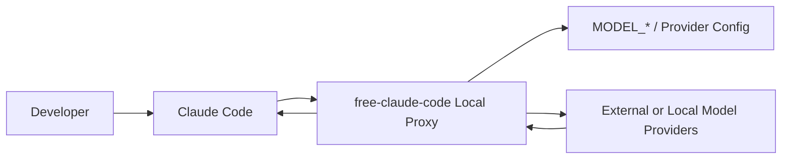
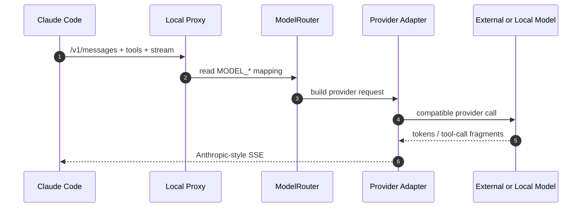
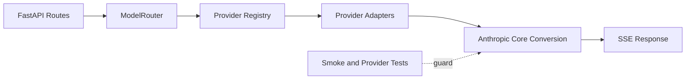

# free-claude-code 项目洞察报告

- URL：https://github.com/Alishahryar1/free-claude-code
- 采用判断：适合本地试点
- 判断说明：适合在本机或内网低风险仓库验证；公网共享前必须补鉴权、日志脱敏和 provider 兼容边界。
- 分析方式：静态分析，DeepWiki 仅作辅助理解

## 1. 新用户先看什么

### 适合谁
- 已经在用 Claude Code，但想比较本地模型或多 provider 的个人开发者。
- 需要在低风险仓库中验证替代 provider 成本、可用性和工具调用效果的小团队。

### 解决什么问题
- Claude Code 的默认 provider 可能受成本、配额、区域访问和可用性影响。
- 直接换客户端会破坏工作流；该项目保持 Claude Code 入口不变，只替换后端模型路径。

### 和别的方案哪里不同
- 核心不是普通 API wrapper，而是 Anthropic Messages / SSE / tool use 兼容层。
- 它需要持续处理 Claude Code 行为、provider schema 和流式响应差异。

### 为什么现在值得看
- 本地模型和 OpenAI-compatible provider 增多，Claude Code 用户自然会需要可切换后端。
- 项目已沉淀 provider registry、fast-path 处理和测试资产，不只是一次性配置脚本。

### 最小验证方式
- 本机启动代理，设置 ANTHROPIC_BASE_URL 指向本地服务。
- 选一个低风险仓库，验证长任务、工具调用、SSE 流式输出和错误恢复。

## 2. Gold Example / Demo

- 示例：把 Claude Code 指向本地代理
- 来源：仓库 README 示例图 + 静态推演
- 启动本地代理服务，例如 localhost:8082。
- 把 ANTHROPIC_BASE_URL 指向本地代理。
- 用 MODEL_* 把 Claude 模型名映射到 provider/model。
- Claude Code 继续按 Anthropic API 说话，代理负责转发、转换和兜底。

## 3. 项目机制图

- 图型选择：UML Sequence, UML Component, CLD
- 选择理由：该项目的关键不是 UI，而是一次 Claude Code 请求如何穿过兼容代理，以及兼容覆盖如何带来更多试点反馈。
- 场景：用户在 Claude Code 中发起一次需要工具调用的 coding 任务。
- Claude Code -> Local Proxy：/v1/messages + tools + stream；客户端入口保持不变
- Local Proxy -> ModelRouter：读取 MODEL_* 映射；决定目标 provider/model
- ModelRouter -> Provider Adapter：构造 provider 请求；处理 schema、tools、thinking
- Provider Adapter -> 外部/本地模型：发送兼容请求；获得 token/工具调用片段
- Provider Adapter -> Claude Code：Anthropic-style SSE 返回；客户端继续按原工作流执行

## 4. 自适应架构视角

- 项目复杂性评估结果：中等
- 选用的架构描述框架：C4 模型
- 裁剪策略理由：这是单入口 API proxy / provider adapter 项目，核心风险在请求转换和 provider 兼容，不需要完整 4+1。保留 C4 L1/L2 和一个核心 Dynamic 交互图。
- 省略内容：省略独立 Physical View；部署边界只保留为本地/内网/公网安全约束。

### 系统全貌

- 视图类型：C4 L1 Context
- 说明：系统边界是 Claude Code 与模型 provider 之间的本地/自托管兼容代理。

### 核心业务流转 -> PRIORITY

- 视图类型：C4 Dynamic / UML Sequence
- 场景描述：Claude Code 发起一次包含 tools 和 stream 的 coding 请求。
- 说明：重点不是静态模块名，而是 Anthropic 请求如何经过路由、适配和 SSE 回传。

### 静态组织结构

- 视图类型：C4 L2 Container
- 说明：静态结构只展示真正影响扩 provider 和维护兼容层的容器/模块边界。

## 5. 核心资产与价值

- Provider Registry：provider catalog、凭据检查、base URL、factory 和 cache 的统一生命周期。
- Anthropic Core：SSE、conversion、thinking、tools、tokens 处理，是兼容 Claude Code 的核心。
- Fast-path 识别：quota、title、prefix、suggestion、filepath 小请求可本地响应，降低延迟和消耗。
- 测试资产：provider、API、SSE、CLI 和 smoke 测试让兼容层更可维护。

## 6. 采用前确认

- 先在单机或内网试点，不要直接开放公网。
- 重点验证工具调用质量、长上下文稳定性和 provider 错误恢复。
- 团队共享前补全鉴权、日志脱敏、web_fetch 限制和 provider 兼容矩阵。

## 证据与边界

- 未检索到稳定 DeepWiki 首页；本轮以 README、源码结构和本地报告为主。
- README 引用本地 pic.png 示例图。
- api/routes.py、api/services.py、providers/registry.py、core/anthropic/ 支撑兼容代理判断。
- 未真实启动服务、未调用 provider、未运行 Claude Code。
