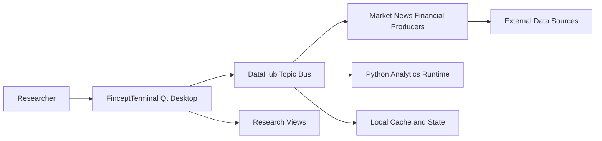
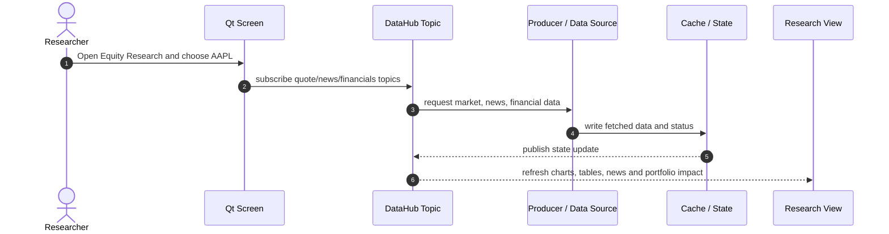
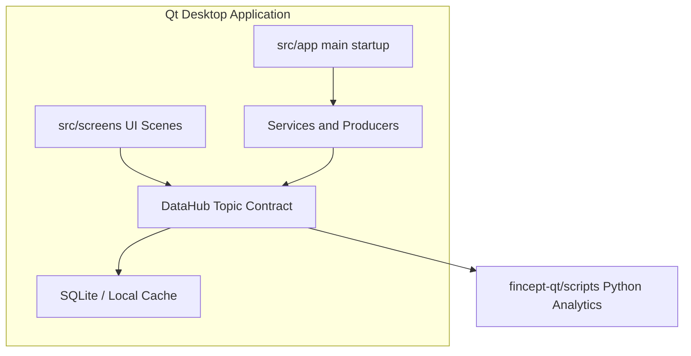
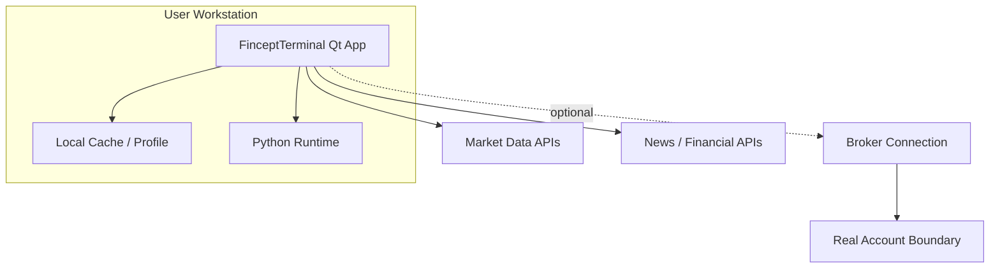

# FinceptTerminal 项目洞察报告

- URL：https://github.com/Fincept-Corporation/FinceptTerminal
- 采用判断：适合学习研究；机构采用前需审计
- 判断说明：适合先用产品图对应的研究场景理解价值；机构接入前必须审许可证、构建复现、数据源授权和交易安全。
- 分析方式：静态分析，DeepWiki 仅作辅助理解

## 1. 新用户先看什么

### 适合谁
- 个人投资者、金融工程学习者、开源量化开发者。
- 想低成本探索行情、研究、组合与 Python 分析整合的小团队。
- 希望理解金融终端架构、DataHub 数据分发和桌面工作台组织方式的技术人员。

### 解决什么问题
- Bloomberg/Eikon 昂贵；开源金融工具往往散落在行情、分析、新闻、交易等不同工具里。
- 用户真正需要的是一个能串起研究流程的工作台，而不只是 API 列表。

### 和别的方案哪里不同
- 核心差异是 Qt 原生桌面 UI + DataHub topic contract + Python 金融脚本生态 的组合。
- 如果 DataHub 治理得住复杂数据源，它有机会从功能集合变成可扩展终端平台。

### 为什么现在值得看
- 开源金融数据、Python 分析和本地 AI agent 都在成熟，桌面集成工作台有现实试用价值。
- 仓库已有多张产品截图、DataHub 架构文档和大量 C++/Python 资产，足以做场景级静态评估。

### 最小验证方式
- 先围绕 Equity Research 页面验证一个标的研究路径，例如 AAPL。
- 确认 installer/构建、行情数据、Python analytics、DataHub topic 更新和缓存行为。
- 真实账户、交易、机构数据源必须延后到许可证和安全审计之后。

## 2. Gold Example / Demo

- 示例：AAPL 研究工作流
- 来源：仓库 README 产品图 + 静态推演
- Demo 状态：静态推演，未运行
- 打开 Equity Research 或 Markets 页面，输入 AAPL。
- Qt Screen 发出标的请求，DataHub 订阅 market:quote:AAPL 等 topic。
- Producer 拉取行情、新闻或财务数据，缓存后发布给页面。
- 研究员在同一工作台查看行情、新闻、财务、组合影响。

## 3. 项目机制图

- 图型选择：UML Component, UML Sequence, SFD
- 选择理由：这是桌面金融工作台，核心要解释 UI、DataHub、Producer、缓存和研究视图如何协作；数据/研究上下文积累更适合用 SFD 表达。
- 场景：研究员在 Equity Research 中查看 AAPL，并希望把行情、新闻、财务和组合影响放到同一上下文。
- 研究员 -> Qt Screen：选择 AAPL / 打开研究页；形成研究任务
- Qt Screen -> DataHub Topic：订阅 quote/news/financials；页面不直接管理所有数据源
- DataHub Topic -> Producer/Data Source：请求行情、新闻、财务数据；多来源数据进入统一 topic
- Producer/Data Source -> Cache/State：写入缓存和状态；减少重复请求并保留上下文
- Cache/State -> 研究视图：发布更新；图表、表格、新闻和组合影响同步刷新

## 4. 自适应架构视角

- 项目复杂性评估结果：复杂 / 异构
- 选用的架构描述框架：4+1 视图模型 + C4/UML 标注
- 裁剪策略理由：该项目横跨 Qt 桌面 UI、DataHub、Producer、缓存、Python runtime、外部数据源和潜在 broker。保留场景视图、过程视图、开发/实现视图和部署视图；不再输出五张孤立文字卡。
- 省略内容：省略单独 Logical 文字卡；逻辑对象已经合并进 C4 L1/L2 和核心过程图，避免重复解释。

### 系统全貌

- 视图类型：场景视图(+1) / C4 L1 Context
- 说明：以 AAPL Equity Research 作为 Scenario，先界定研究员、桌面终端和外部数据源的系统边界。

### 核心业务流转 -> PRIORITY

- 视图类型：Process View / UML Sequence
- 场景描述：研究员在 Equity Research 中查看 AAPL，并希望把行情、新闻、财务和组合影响放到同一上下文。
- 说明：这是必须优先理解的交互图：Screen 不直接管理所有来源，而是通过 DataHub topic 组织数据流和状态刷新。

### 静态组织结构

- 视图类型：Development / Implementation View with C4 L2/L3
- 说明：静态组织结构只展示开发边界：UI 场景、应用装配、DataHub、Producer、缓存和 Python 脚本生态。

### 物理 / 部署视图

- 视图类型：C4 Deployment
- 说明：机构采用前真正要确认的是运行节点、外部依赖、数据授权和真实账户边界，而不是把 README 截图当作可部署证明。

## 5. 核心资产与价值

- DataHub topic contract：把 markets、news、economics、broker、agents 的数据状态统一到可订阅层。
- 原生终端框架：src/app/main.cpp 初始化 profile、crash、metatypes、DataHub producers 和服务。
- Python 金融脚本：fincept-qt/scripts/ 覆盖分析、agents、数据获取和量化模块。
- 桌面 UI 资产：src/screens/ 下的金融场景页面形成 Bloomberg-like 工作台体验。

## 6. 采用前确认

- 学习和研究用途可先试用产品图对应的核心场景。
- 机构采用前必须确认 AGPL/商业许可、构建复现、数据源授权和交易安全。
- 不要先接真实账户；先验证 installer、market data、Python analytics 和 DataHub 行为。

## 证据与边界

- DeepWiki 将其拆到 data connectors 等专题，说明复杂度主要集中在数据源与终端集成。
- 本轮 DeepWiki 只作辅助理解；关键判断仍以 README、架构文档、DataHub 文档和源码入口为准。
- README 本地图片包含 EquityResearch、Portfolio、News、NodeEditor 等产品截图。
- docs/ARCHITECTURE.md 与 fincept-qt/DATAHUB_ARCHITECTURE.md 支撑 Screen/Service/DataHub 判断。
- 未构建 Qt、未运行 installer、未连接真实数据源或 broker。
