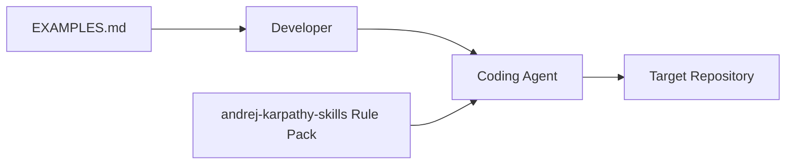
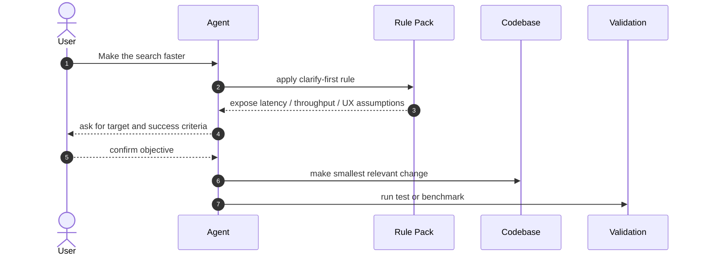
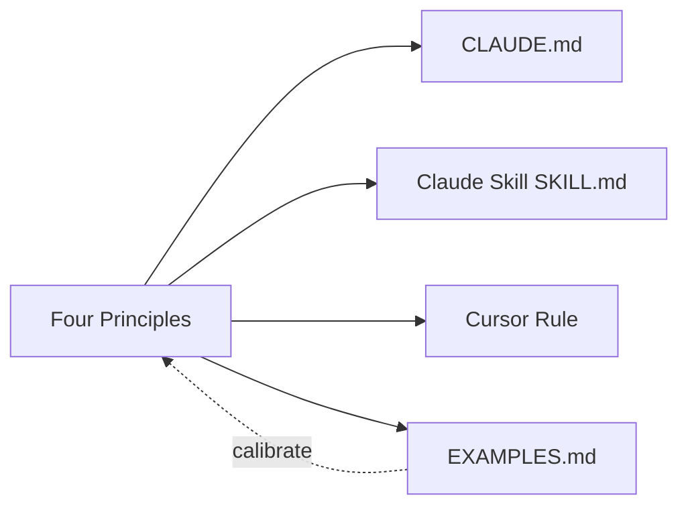

# andrej-karpathy-skills 项目洞察报告

- URL：https://github.com/forrestchang/andrej-karpathy-skills
- 采用判断：适合作为 Agent 行为基线；仍需 eval 验证
- 判断说明：适合先作为团队 agent 指令基线；要证明长期价值，需要用真实 PR 或任务集评估返工率和无关 diff 是否下降。
- 分析方式：静态分析，DeepWiki 仅作辅助理解

## 1. 新用户先看什么

### 适合谁
- Claude Code / Cursor 用户。
- 维护团队级 agent 指令、想减少返工和无关 diff 的工程团队。
- 正在整理 AI coding 规范、但不想维护长篇流程文档的团队。

### 解决什么问题
- Coding agent 容易隐藏假设、过度抽象、顺手改无关代码、没有明确验收目标。
- 团队需要短、硬、可复制的行为规则，而不是长篇抽象建议。

### 和别的方案哪里不同
- 四条原则足够短：先澄清、简单优先、外科式修改、目标驱动执行。
- 同一规则被分发为 CLAUDE.md、Skill、Cursor rule 和 plugin manifest，降低采用成本。

### 为什么现在值得看
- Agent coding 已经成为日常开发入口，团队开始需要稳定行为基线。
- 项目传播势能强，说明这类“短规则 + 多分发格式”的需求真实存在。

### 最小验证方式
- 把规则加入一个真实 repo，选择 5-10 个历史小任务做前后对照。
- 观察 agent 是否减少无关 diff、是否更早澄清目标、是否更少过度设计。

## 2. Gold Example / Demo

- 示例：Make the search faster
- 来源：仓库 EXAMPLES.md 示例
- Demo 状态：静态推演，未运行
- 用户只说“让搜索更快”，但“快”可能指响应时间、吞吐量或感知速度。
- 错误做法：agent 静默选择缓存、索引、异步等方案并开始大改。
- 正确做法：先列出三种解释、成本和影响，再让用户确认目标。
- 价值：减少错误方向、过度实现和返工。

## 3. 项目机制图

- 图型选择：行为流程, BOT
- 选择理由：这是规则/skill 项目，核心不是系统调用链，而是模糊需求如何被规则转成可验证行动；长期效果适合用概念 BOT 展示。
- 场景：用户给 agent 一个模糊请求：Make the search faster。
- 用户 -> Agent：提出模糊目标；Make the search faster
- Agent -> 规则基线：触发先澄清原则；列出 latency / throughput / UX
- 用户 -> Agent：确认优化目标；锁定成功标准
- Agent -> 代码修改：执行最小路径修改；避免顺手重构
- Agent -> 验证：运行测试或基准；确认目标达成

## 4. 自适应架构视角

- 项目复杂性评估结果：简单
- 选用的架构描述框架：C4 模型（轻量裁剪）
- 裁剪策略理由：这是文档/规则包，不是运行时系统。只保留 Context、核心规则交互和分发结构；不使用 4+1、部署图或物理视图。
- 省略内容：省略 4+1、C4 Deployment 和系统动力部署视角；这些视角会把规则包讲成不存在的运行系统。

### 系统全貌

- 视图类型：C4 L1 Context
- 说明：系统边界是开发者、coding agent 和规则包之间的行为约束关系。

### 核心业务流转 -> PRIORITY

- 视图类型：C4 Dynamic / Behavior Sequence
- 场景描述：用户提出 Make the search faster 这类模糊请求。
- 说明：规则包的价值体现在 agent 如何先暴露假设、确认目标，再最小修改并验证结果。

### 静态组织结构

- 视图类型：C4 L2 Container（分发结构）
- 说明：静态结构是多分发格式，而不是服务容器。

## 5. 核心资产与价值

- CLAUDE.md：适合直接复制到项目根的核心单文件指令。
- SKILL.md：Claude plugin 兼容版本，便于作为 skill 分发。
- Cursor Rule：alwaysApply: true，适合 Cursor 项目级规则。
- EXAMPLES.md：用真实反例和正确行为解释四原则，降低误用概率。

## 6. 采用前确认

- 适合作为团队 agent 行为基线，但不要替代项目自己的工程规则。
- 简单小改可以快速执行；复杂任务启用澄清、目标定义和验证闭环。
- 建议补 eval 或 PR 对照，用真实 diff 噪声下降来验证价值。

## 证据与边界

- DeepWiki 将项目解释为解决 silent assumptions、over-abstraction、collateral damage 的四原则系统。
- DeepWiki 还强调双路径集成：全局 plugin 与项目级 CLAUDE.md；这与本地 README/EXAMPLES.md 一致。
- README.md 描述四原则与安装方式。
- EXAMPLES.md 提供 “Make the search faster” 等 before/after 案例。
- DeepWiki 页面补充了问题分类、原则映射和分发模型；未真实运行目标项目，也未做真实 AB eval。
