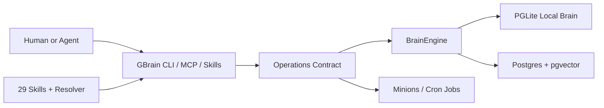
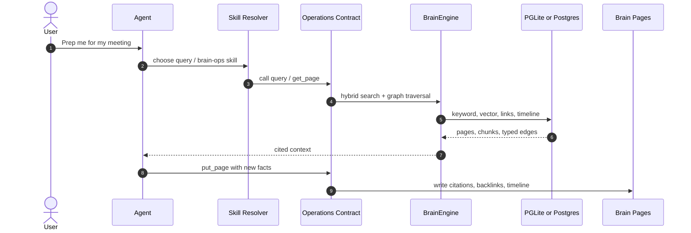
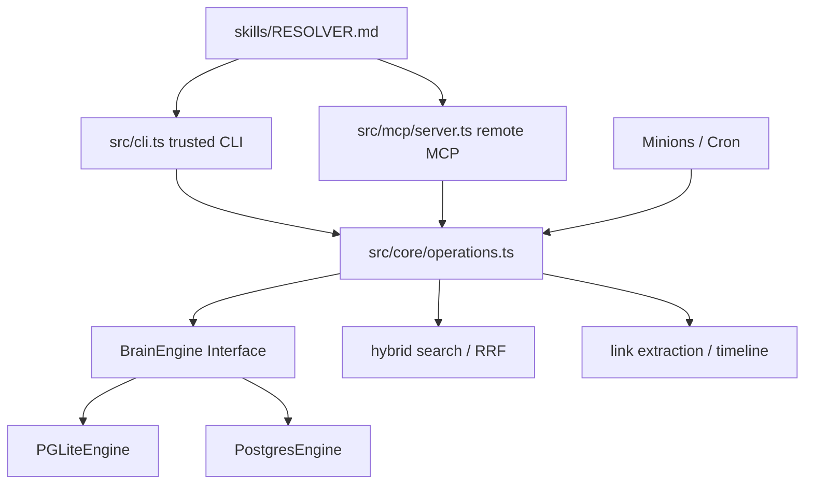
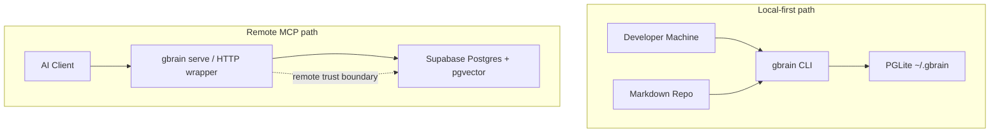

# GBrain 项目洞察报告

- URL：https://github.com/garrytan/gbrain
- 采用判断：适合 agent-heavy 团队试点
- 判断说明：适合已经有 Markdown 知识库、MCP/CLI agent 工作流和长期记忆痛点的个人或小团队；正式托管前要验证隐私、迁移、远程 MCP 权限和数据库运维。
- 分析方式：静态分析，DeepWiki 仅作辅助理解

## 1. 新用户先看什么

### 适合谁
- 已经用 Claude Code、OpenClaw、Hermes、Cursor 或自建 MCP agent 的重度用户。
- 有 Markdown/Obsidian/Notion/会议/邮件/网页等长期知识资产，希望 agent 能跨任务复用的人。
- 愿意让 agent 参与安装、导入、维护和定期任务的小团队或个人研究者。

### 解决什么问题
- 通用 coding/chat agent 会忘记历史上下文，下一次任务仍要重新喂资料。
- 纯向量搜索很难回答关系型问题，例如谁和谁一起出现、某家公司和某人有什么关系。
- 知识库会随时间变脏：引用、反链、孤儿页面、迁移和 cron 任务都需要持续维护。

### 和别的方案哪里不同
- 它把 CLI/MCP operations、pluggable engine、graph/timeline extraction 和 skill workflows 合在一起，而不是只做一层 RAG。
- 默认本地 PGLite 两秒可起步，同时保留 Postgres + pgvector / Supabase 的规模化路径。
- 仓库把 agent 操作协议写进 AGENTS.md、CLAUDE.md、skills/RESOLVER.md，把“人读文档”改成“agent 按协议执行”。

### 为什么现在值得看
- MCP 和 agent skill 正在成为工具接入层，GBrain 正好把个人知识库包装成 agent 可操作的工具表面。
- 仓库更新很活跃：GitHub API 显示 2026-04-28 仍有 push，版本为 0.22.6.1。
- README 给出生产使用数据和 BrainBench 结果，但这些是项目方声明，采用前仍需复现实验。

### 最小验证方式
- 不要先上远程 MCP；本地 bun install && bun link 后用 PGLite 跑 gbrain init。
- 导入 20-50 篇自己的 Markdown，跑 gbrain query、gbrain graph-query、gbrain stats，观察是否真的回答出关系型问题。
- 再打开 MCP，仅暴露低风险目录，验证 OperationContext.remote 对 file_upload 等敏感操作的约束。

## 2. Gold Example / Demo

- 示例：会议前上下文准备：从问题到 brain-first 回答
- 来源：README CLI / meeting 示例 + 静态推演，未运行
- 用户问：Prep me for my meeting with Jordan in 30 minutes。
- Agent 先按 skills/RESOLVER.md 选择 query / brain-ops，而不是直接上网或凭记忆回答。
- query 通过 operations contract 调用 hybrid search、typed links 和 timeline，拉出相关人、公司、过往会议和 open threads。
- 若产生新事实，put_page 写回页面并触发 auto-link / citation 维护，让下一次查询更好。

## 3. 项目机制图

- 图型选择：UML Sequence, UML Component, CLD / SFD
- 选择理由：GBrain 的关键是 read-enrich-write 循环如何把 agent 请求、skill 路由、operations contract、engine/search/graph 和写回维护串成一个会复利的系统。
- 场景：用户要求 agent 准备一次会议，agent 需要先查 brain，再把新信息写回。
- 用户 / Agent -> Skill Resolver：提出会议准备或知识查询；根据触发词选择 query / brain-ops
- Skill Resolver -> Brain Ops / Query Skill：读取对应 skill；执行 brain-first 流程
- Brain Ops / Query Skill -> Operations Contract：调用 query / get_page / put_page；CLI 与 MCP 共用同一契约
- Operations Contract -> BrainEngine：hybrid search + graph/timeline；抽象 PGLite/Postgres
- BrainEngine -> PGLite / Postgres：keyword/vector/link 查询；返回页面、chunks、typed edges
- Operations Contract -> Brain Pages：写回引用、反链、timeline；下一轮查询获得更多上下文

## 4. 自适应架构视角

- 项目复杂性评估结果：复杂 / 异构
- 选用的架构描述框架：4+1 理论裁剪 + C4/UML 表达
- 裁剪策略理由：项目横跨 CLI、MCP、skillpack、pluggable database engine、hybrid search、graph/timeline、Minions job queue 和远程 trust boundary。使用 4+1 作为分类，但只保留场景、过程、开发/实现和部署边界。
- 省略内容：不单独输出抽象 Logical 文字卡；逻辑对象已合并到系统全貌、核心交互和静态组织图中。未画完整 cron/voice/webhook 生态，避免把 README 声明当成已验证部署。

### 系统全貌

- 视图类型：场景视图(+1) / C4 L1 Context
- 说明：系统边界是 agent-facing CLI/MCP/skills 到 operations contract，再到本地 PGLite 或远程 Postgres brain engine。

### 核心业务流转 -> PRIORITY

- 视图类型：Process View / UML Sequence
- 场景描述：用户要求 agent 准备一次会议或回答跨页面知识问题。
- 说明：重点是一次请求如何先查 brain、合成回答，再通过写回和 auto-link 让后续查询变好。

### 静态组织结构

- 视图类型：Development / Implementation View with C4 L2
- 说明：静态结构展示开发边界：CLI/MCP 表面、operations contract、engine/search/link extraction、skills 和 jobs。

### 部署 / 信任边界

- 视图类型：C4 Deployment
- 说明：最小试点用本地 PGLite；远程 MCP 和 Supabase/Postgres 才需要额外审权限、凭据、RLS、备份和访问边界。

## 5. 核心资产与价值

- `src/core/operations.ts`：CLI、MCP、工具定义和 mutating/read 操作共享的契约层，是可维护性的核心。
- `BrainEngine` + engines：PGLite 本地零配置和 Postgres/pgvector 规模化路径共用接口，减少后续迁移成本。
- `hybrid.ts` + graph/timeline：keyword、vector、RRF、source boost、typed links 和 timeline 共同支撑非纯语义检索问题。
- `skills/RESOLVER.md` + 29 skills：把 agent 行为、导入、查询、维护、skillify、minions 等流程显式化。
- 测试与 CI：test/ 约 190 个测试文件，CI 跑 gitleaks 与 bun run test，比普通个人工具更重视回归。

## 6. 采用前确认

- 先本地 PGLite 试点，不要一开始开放远程 MCP 或接真实隐私数据。
- 用自己的 20-50 篇 Markdown 做最小集，验证 query、graph-query、stats、links/timeline 是否真实增益。
- 再验证敏感路径：file_upload confinement、remote=true 行为、MCP token/HTTP wrapper、Supabase 备份和 RLS。
- 对 README 的生产数字和 BrainBench 结论保持关注，但采用前应在自己的 corpus 上复现检索质量。

## 证据与边界

- 本轮未使用 DeepWiki 作为主要来源；以 GitHub API、README、AGENTS/CLAUDE、源码、docs、CI 和测试目录为静态证据。
- GitHub API：garrytan/gbrain，TypeScript，MIT，stars 11,973，forks 1,458，open issues 303，最近 push 2026-04-28。
- README.md 描述 29 skills、30+ MCP tools、PGLite/Postgres、BrainBench 和生产脑数据；这些生产数字未在本地复现。
- AGENTS.md 明确安装流程、read order、trust boundary 和 before shipping 流程。
- CLAUDE.md 与 docs/ENGINES.md 支撑 BrainEngine、PGLite/Postgres、operations contract 和测试体系判断。
- src/core/operations.ts、src/mcp/server.ts、src/core/engine.ts、src/core/search/hybrid.ts、skills/RESOLVER.md 支撑架构判断。
- 未真实运行 bun install、gbrain init、MCP server、PGLite/Postgres 或 BrainBench；本报告为静态分析，未真实运行目标项目。
