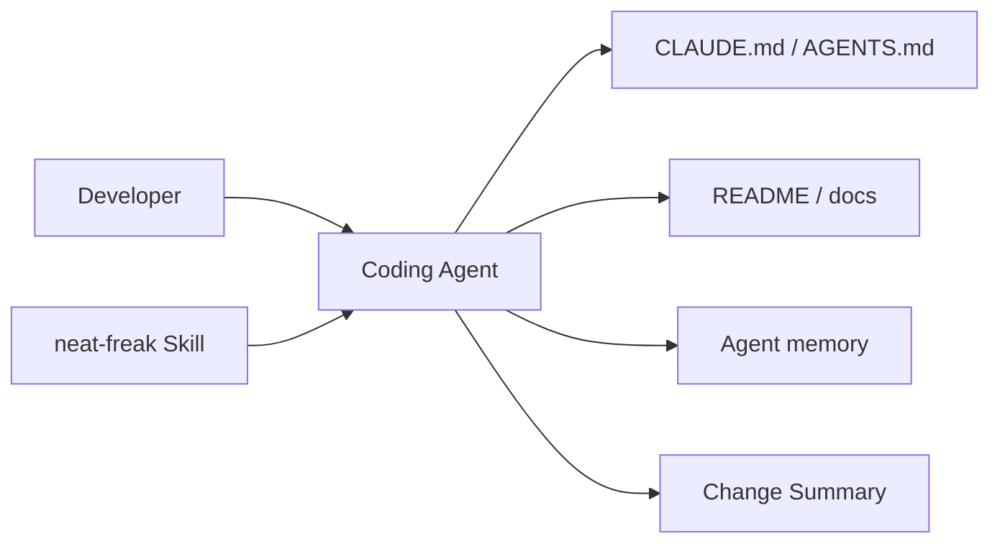
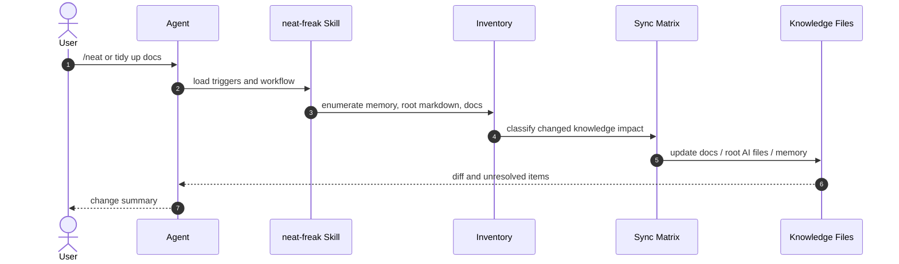
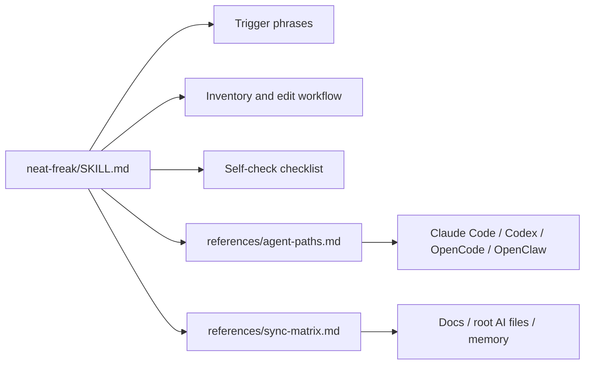

# neat-freak（洁癖） 项目洞察报告

- URL：https://github.com/KKKKhazix/khazix-skills/tree/main/neat-freak
- 采用判断：适合作为会话收尾基线；团队推广前需试运行
- 判断说明：适合已经依赖 coding agent 的个人或小团队，把文档、AGENTS/CLAUDE 和记忆同步变成固定收尾动作；团队强制前需要确认路径、删除策略和人工复核边界。
- 分析方式：静态分析，DeepWiki/Zread 仅作为派生资源链接，未作为证据来源

## 1. 新用户先看什么

### 适合谁
- 已经把 Claude Code、Codex、OpenCode 或 OpenClaw 用在真实仓库里的个人开发者。
- 经常遇到 README、docs、AGENTS.md / CLAUDE.md 和 agent 记忆互相矛盾的小团队。
- 需要把阶段性交付变成可交接上下文，而不想每次手工梳理知识库的人。

### 解决什么问题
- AI 协作中的文档和记忆会慢慢腐化：代码已改，README 还是旧版，agent 下次会基于错误前提继续工作。
- 普通收尾总结只会追加记录；neat-freak 把旧信息合并、修正、删除，并要求按受众同步到不同知识层。

### 和别的方案哪里不同
- 它明确区分三层受众：agent 记忆、项目根 CLAUDE.md / AGENTS.md、面向人的 docs/ / README。
- 它不是只更新 memory 的工具，而是先机械式枚举文件，再用 sync-matrix.md 判断每类代码变化要波及哪些文档。

### 为什么现在值得看
- AI coding 已经进入多轮、多 agent、跨会话协作阶段，错误上下文会直接放大返工和误改风险。
- 项目用 3 个文件把触发词、执行流程、跨平台路径和变更影响矩阵压成可安装 skill，试用成本低。

### 最小验证方式
- 选一个低风险仓库，完成一次真实小任务后运行 /neat 或 整理一下。
- 重点观察它是否发现 README/docs/AGENTS/记忆里的过期内容，以及是否只改应该改的知识层。
- 第一次试运行后人工 review diff，再决定是否把它加入团队收尾流程。

## 2. Gold Example / Demo

- 示例：一次开发会话结束后的知识同步
- 来源：仓库 SKILL.md 流程 + 静态推演
- Demo 状态：静态推演，未运行
- 开发任务完成后，用户输入 /neat 或自然语言“整理一下”。
- Agent 按 skill 要求列出 memory、项目根 markdown、README 和 docs，并标记评估过/要改/不用改。
- Agent 用变更影响矩阵判断本次代码或流程变化该同步到哪些知识层。
- Agent 真实修改 docs、AGENTS/CLAUDE 或记忆文件，删除过期项，最后输出变更摘要。

## 3. 项目机制图

- 图型选择：行为流程, UML Component, BOT
- 选择理由：这是文档/skill/rule-pack 项目，关键不是服务调用链，而是一次会话收尾如何从触发词走到文件盘点、影响矩阵、实际编辑和自检；长期价值只适合用概念 BOT 表达。
- 场景：用户完成一个开发阶段后，希望把代码变化同步到文档、根级 AI 指令和 agent 记忆。
- 用户 -> Agent：输入 /neat 或“整理一下”；触发会话收尾同步
- Agent -> 盘点清单：枚举 memory / 根 markdown / docs；先 ls 再判断
- 盘点清单 -> 影响矩阵：映射本次变更类型；决定波及哪些知识层
- 影响矩阵 -> 知识文件：编辑 docs / AGENTS / memory；合并、修正、删除过期信息
- 知识文件 -> 变更摘要：输出已改和未处理项；给用户可审查结果

## 4. 自适应架构视角

- 项目复杂性评估结果：简单
- 选用的架构描述框架：C4-light + 行为序列
- 裁剪策略理由：这是 agent skill 和规则包，不是运行时系统。保留 Context、核心行为序列和静态组织/分发视图；用图解释职责边界和知识层，不画不存在的服务部署。
- 省略内容：省略 4+1、Deployment/Physical View、数据库和 API 视图；目标目录没有运行时代码、测试入口或部署单元。

### 系统全貌

- 视图类型：C4-light Context
- 说明：系统边界是开发者、coding agent、neat-freak skill 和被同步的三类知识文件。

### 核心业务流转 -> PRIORITY

- 视图类型：C4 Dynamic / Behavior Sequence
- 场景描述：开发任务结束后，用户运行 /neat。
- 说明：重点是 skill 如何把一个收尾触发转成文件盘点、影响分析、真实编辑和可审查摘要。

### 静态组织结构

- 视图类型：C4 L2 Container（规则分发结构）
- 说明：静态结构展示 SKILL.md 如何依赖两份 reference 文件，把触发、盘点、影响矩阵和平台路径连接起来。

## 5. 核心资产与价值

- neat-freak/SKILL.md：核心资产：触发词、角色定位、强制盘点、实际编辑和最终摘要格式都在这里。
- references/agent-paths.md：跨平台路径速查，尤其明确 Codex 没有独立记忆索引，项目事实应进入 AGENTS.md。
- references/sync-matrix.md：把 API、环境变量、数据库、用户流程等变化映射到应同步的文档层。
- README 集成说明：仓库根 README 给出安装入口、触发方式、三层知识边界和 ClawHub/Tessl 分发信号。

## 6. 采用前确认

- 先在低风险仓库跑一次，并人工 review 所有 diff。
- 团队使用前要明确哪些 memory / docs / root markdown 可以由 agent 自动编辑，哪些必须人工确认。
- 不要把它当成架构审查或测试替代品；它解决的是知识同步，不保证代码正确。
- 对跨项目仓库尤其要检查 sync-matrix 的下游文档同步规则，避免只更新上游说明。

## 证据与边界

- 本轮未把 DeepWiki 或 Zread 作为事实依据；报告页面仅提供从 GitHub 仓库 URL 派生的外部阅读链接。
- 事实判断来自 GitHub README、neat-freak/SKILL.md、两份 references、MIT license 和 GitHub API 元数据。
- README.md 说明 skills 遵循 Agent Skills 开放标准，支持 Claude Code、Codex、OpenCode、OpenClaw。
- README.md 的 neat-freak 小节描述三层同步对象：项目根 AI 指令、docs/README、agent 记忆。
- neat-freak/SKILL.md 要求先枚举再判断，并要求实际修改文件而不是只描述计划。
- references/agent-paths.md 记录不同平台的记忆与配置路径差异。
- references/sync-matrix.md 记录代码变化到文档层的映射和记忆清理规则。
- 未安装、未触发 /neat，未验证它在真实仓库中的自动编辑质量。
